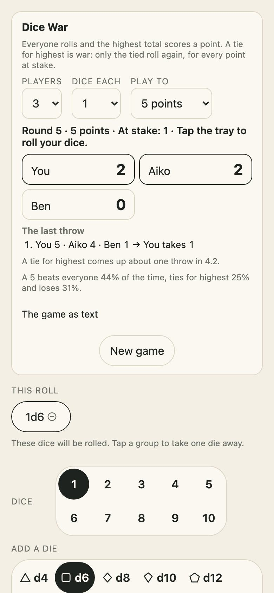

<h1 align="center">Korokoro <sub>コロコロ</sub></h1>

<p align="center"><strong>Fair dice for the table, with the odds of every throw.</strong><br>
Tap dice to build a roll, up to ten in any mix from a d4 to a d100, or type any dice at all. Exact probabilities, roll history and stats, in a tray that runs anywhere.</p>

<p align="center">
  <a href="https://github.com/johnmorrisdotca/korokoro/actions/workflows/ci.yml"></a>
  <a href="https://www.npmjs.com/package/@johnmorrisdotca/korokoro"></a>
  <a href="./LICENSE"></a>
  
  
</p>

<p align="center"><a href="https://johnmorrisdotca.github.io/korokoro/"><strong>Roll some dice →</strong></a> · <a href="https://johnmorrisdotca.github.io/korokoro/docs/"><strong>Read the documentation →</strong></a></p>

<p align="center">
  
  
</p>

A dice roller and a dice notation parser for tabletop games, RPGs and board
games, with the exact odds of every roll.

- **What is different.** The odds are exact, worked out and never simulated,
  for every notation it reads. The tray is finished: dice you tap, real dice
  sounds, history, stats and a link to any roll. And a seeded roll can be
  checked by anybody, die for die.
- **What it costs a project.** Nothing: no dependencies, and one import.

## Roll in 30 seconds

```sh
npm install @johnmorrisdotca/korokoro    # or pnpm add, or yarn add
```

```ts
import { chanceAtLeast, parseNotation, roll } from "@johnmorrisdotca/korokoro";

const attack = parseNotation("2d20kh1+5")!;  // advantage, plus 5
roll(attack).total;                          // 6 to 25, from the crypto generator
chanceAtLeast(attack, 15);                   // 0.7975: the exact chance of 15 or more
```

And 44 games come with their dice and their rules for reading them:

```ts
import { crapsPass, rollPreset } from "@johnmorrisdotca/korokoro";

rollPreset("yahtzee").reading.text;        // "A full house", "Chance, for 13", …
rollPreset("チンチロリン", { language: "ja" }).reading.text;  // "シゴロ（4・5・6）", …
crapsPass();                                // [244n, 495n]: the shooter's exact chance, 244 in 495
```

And from a terminal, on Linux, macOS or Windows:

```sh
npx @johnmorrisdotca/korokoro 2d20kh1+5 --seed table   # 2d20kh1+5: 24  [19 (12)]
```

Or with nothing to install, [roll some dice in the demo](https://johnmorrisdotca.github.io/korokoro/).

## Who it is for

- **Roleplaying games.** A d20 with advantage (`2d20kh1+5`), ability scores
  (`4d6dl1`), a fireball's damage (`8d6`), a d20 and a d4 together
  (`1d20+1d4`). For Dungeons & Dragons, Pathfinder and anything else that
  rolls polyhedral dice.
- **Board games and dice games.** `2d6` for the table; five dice with holds
  for Yahtzee (`5d6`); six for Farkle (`6d6`); a die with your game's own
  faces (`d[Hit,Miss,Miss]`).
- **Fun.** Tap the felt.
- **Teaching and research.** The exact odds and a chart for any roll: `2d6`
  makes 7 one time in 6. A seed makes a classroom's rolls repeatable.
- **The curious and the suspicious.** Loaded dice that say they are loaded
  (`d6{6:3}`), and a test for whether a real die is fair.

Game names are trademarks of their respective owners. Korokoro is not
affiliated with or endorsed by them; it rolls the dice their rules call for.

## Use it in your project

Korokoro is an API and a tray, each usable without the other: **an API** of
plain functions (roll, read notation, work out odds, keep a history), and **a
tray** you mount into any element, which also comes as **a React component**,
**a Vue component** and **a web component**.

### 1. The API alone

```ts
import { checkNotation, distributionOf, roll, seededSource } from "@johnmorrisdotca/korokoro";

const read = checkNotation("4d6dl1");            // { ok: true, spec } or the part refused and why
if (read.ok) {
  const thrown = roll(read.spec, seededSource("table-7"));
  thrown.faces;                                  // [6, 4, 2, 1]: every die, in the order thrown
  thrown.kept;                                   // [true, true, true, false]: the 1 was dropped
  thrown.total;                                  // 12
  distributionOf(read.spec).probabilities;       // the exact chance of every total from 3 to 18
}
```

### 2. The tray, in plain HTML

```html
<div id="dice"></div>
<script type="module">
  import { mountRoller } from "@johnmorrisdotca/korokoro";

  mountRoller(document.getElementById("dice"), {
    spec: { count: 1, sides: 20, modifier: 5 },
    onRoll: (roll) => console.log(roll.total),
  });
</script>
```

### 3. React

```tsx
import { DiceRoller } from "@johnmorrisdotca/korokoro/react";

export function Table() {
  return <DiceRoller wide notation="2d20kh1+5" onRoll={(roll) => save(roll)} />;
}
```

The component takes the tray's options as props, `notation` as a shorter way
to give the dice (the tray follows it when it changes), and any attribute for
its `<div>`. The tray mounts in the browser after the first render, so server
rendering draws an empty box and nothing needs a provider. In Next.js, use it
from a client component (`"use client"`).

### 4. Vue

```vue
<script setup>
import { DiceRoller } from "@johnmorrisdotca/korokoro/vue";
</script>

<template>
  <DiceRoller notation="2d20kh1+5" wide @roll="(roll) => save(roll)" />
</template>
```

The props are the tray's options, with `notation` as a shorter way to give the
dice, and each roll is a `roll` event. The dice and `locale` are followed as
they change; `roll()`, `history()`, `setSpec()` and `setLocale()` are there on
a template ref. It renders an empty box on the server (Nuxt included) and
mounts the tray in the browser. Vue 3.3 or later.

### 5. A web component

```html
<korokoro-roller notation="2d20kh1+5" wide></korokoro-roller>

<script type="module">
  import { defineRoller } from "@johnmorrisdotca/korokoro/element";

  defineRoller();
  document.addEventListener("korokoro-roll", (event) => console.log(event.detail.total));
</script>
```

A custom element, for any page and any framework that renders HTML. Call
`defineRoller()` once; each roll is a `korokoro-roll` event that bubbles, with
the roll as its `detail`.

Or with no call at all: importing `@johnmorrisdotca/korokoro/element/define`
registers the element by being imported, so one script tag is the whole of
it, [from a CDN](./docs/plain-output.md#from-a-cdn-with-nothing-to-install) or
from your own bundle:

```html
<script type="module" src="https://cdn.jsdelivr.net/npm/@johnmorrisdotca/korokoro@1/dist/element-define.js"></script>
<korokoro-roller notation="2d20kh1+5"></korokoro-roller>
```

| Attribute | What it does |
| --- | --- |
| `notation` | The dice showing at first, and again whenever it changes |
| `lang` | `ja` for Japanese, anything else English; the page's own language when left out |
| `wide` | Tray and panels side by side on a wide screen |
| `size` | `small` is the felt and the result alone, `medium` adds the choice of dice, `large` (or left out) is everything |
| `sound="off"` | No sound and no mute button |
| `hold="off"` | Dice are not held |
| `placeholder="off"` | The opening dice are the user's own roll |
| `keyboard="off"` | Space rolls only when the focus is inside the tray |
| `language-chooser` | The tray's own choice of English or 日本語 |
| `dice-war` | [Dice War](#dice-war) among the games |
| `storage="none"`, `storage-key` | Keep no history; or the key it is kept under |
| `animation-ms`, `share-base`, `query` | As the options of the same names |
| `cloth` | The felt's cloth: `green` (unless said), `blue`, `red`, `black` or `wood`, the family's five; changed in place, keeping the dice and the rolls |
| `one-pip` | The colour of a d6's one pip: `red` (unless said) or `black`; changed in place |

What an attribute cannot carry (a theme, your own words, your own sound) goes
on the element's `options` property. React 19, Vue 3 and Svelte 5 set a
property rather than an attribute on a custom element that has one of the
name; the only name here that is also a property is the die's `face`, and
`die.face = 5` sets the `face` attribute, as the attribute does. `roll()`, `setSpec()` and `history` are
on the element. The tray is drawn in the element's own light DOM, so the
page's `--kk-…` variables theme it as they do a mounted tray.

### One die on its own

A single die with nothing round it: no felt, no total, no panels. For a page
that wants a die to look at, or one to tap. There are two kinds, chosen by one
option.

- **A die that rolls** (`rollable`, the default) is a button. A tap, Enter or
  Space throws it; it tumbles, lands on the face the generator chose before
  anything moved, and says so to a screen reader.
- **A die that does not roll** (`rollable: false`) is a picture of one face,
  the one you give it, changed from code with `show()`.

```ts
import { mountDie } from "@johnmorrisdotca/korokoro";

const die = mountDie(document.getElementById("die"), { sides: 20, size: "large", onRoll: (face) => console.log(face) });
die.roll();                                            // as a tap does

mountDie(document.getElementById("shown"), { sides: 6, face: 5, rollable: false, onePip: "black" });
```

It keeps one steady square (`small` 48 pixels, `medium` 96, `large` 150, or
`width`): the tumble moves only the picture inside it, so nothing on the page
moves. Nothing on it can be selected, and a device that asks for reduced motion
gets no tumble. It is silent unless you say `sound: true`, because a die on
somebody's page has not been asked to make noise.

| Option | Default | What it does |
| --- | --- | --- |
| `sides` | `6` | 2 to 1000, or `"F"` for a Fate die |
| `faces` | none | A die of your own, as in notation's `d[Yes,No]`: `[{ label: "Yes" }, { label: "No" }]` |
| `face` | the top face | The face showing at first |
| `rollable` | `true` | `false` is a die that only shows a face |
| `size`, `width` | `"medium"` | `"small"`, `"medium"` or `"large"`; or a width in pixels, which wins |
| `onePip` | `"red"` | The colour of a d6's one pip: `"red"` or `"black"` |
| `source` | cryptographic | `seededSource("table")` throws the same faces for everyone |
| `animationMs` | `600` | The tumble; reduced motion always skips it |
| `sound`, `playSound` | `false` | Whether a throw makes the sound of dice, and a sound of your own |
| `onRoll` | none | Called with the face once it has landed |
| `cloth`, `theme`, `locale`, `strings` | | As on the tray |

The handle has `roll()`, `show(face)`, `setSides(sides, face?, faces?)`,
`setOnePip(colour)`, `setLocale(locale)`, `setRollable(on)`, `destroy()`, and
`face`, `rolling` and `element`.

As a tag, from the same script as `<korokoro-roller>`:

```html
<script type="module" src="https://cdn.jsdelivr.net/npm/@johnmorrisdotca/korokoro@1/dist/element-define.js"></script>
<korokoro-die sides="20" size="large"></korokoro-die>
<korokoro-die sides="6" face="5" rollable="off"></korokoro-die>
```

| Attribute | What it does |
| --- | --- |
| `sides`, `face` | The kind of die, and the face showing |
| `rollable="off"` | A die that shows and does not roll; `rollable="on"` makes it roll again |
| `size`, `width` | `small`, `medium`, `large`, or pixels |
| `one-pip` | `red` (unless said) or `black` |
| `lang`, `seed`, `sound`, `animation-ms`, `cloth` | As the options of the same names; `sound="on"` for dice sounds |

Each throw is a `korokoro-die-roll` event with the face as its `detail`;
changing `face` shows that face at once. The [demo](https://johnmorrisdotca.github.io/korokoro/#one-die)
has one of each.

### Embed it on any site

A tray on a page you do not build: a blog, a wiki, a forum. Choose how much
of it you want.

| Size | What is shown | Room at 360px wide |
| --- | --- | --- |
| `small` | The felt and the result, for the dice you name. Tap to roll | about 540px tall |
| `medium` | Those, and the choice of dice and bonus | about 1320px |
| `large` | Everything: history, stats and odds too. Side by side from 900px wide | about 1600px |

An iframe, where the page allows no scripts:

```html
<iframe src="https://johnmorrisdotca.github.io/korokoro/embed/?dice=2d6%2B3&size=small" title="Korokoro" width="360" height="540" style="border:0;max-width:100%" loading="lazy"></iframe>
```

The address takes `dice` (any notation), `size`, `lang` (`en` or `ja`),
`sound=off`, `seed`, and the colours `felt` and `ink` as `#rrggbb`. The page
tracks nothing and loads nothing from anywhere else; a large tray keeps its
history on the visitor's own device. Each roll is sent to the page that
frames it: `{ korokoro: "roll", notation, total, dice }` by `postMessage`.

One tag, where the page may run a script, with nothing to install:

```html
<script type="module" src="https://cdn.jsdelivr.net/npm/@johnmorrisdotca/korokoro@1/dist/element-define.js"></script>
<korokoro-roller notation="2d6+3" size="small"></korokoro-roller>
```

[The demo](https://johnmorrisdotca.github.io/korokoro/#embed) writes both
for the dice you last rolled there, with a look at each size.

### 6. Svelte and Angular

The same one call in the framework's mount hook, and `destroy()` on the way
out:

```svelte
<script>
  import { onMount } from "svelte";
  import { mountRoller } from "@johnmorrisdotca/korokoro";
  let box;
  onMount(() => {
    const roller = mountRoller(box);
    return () => roller.destroy();
  });
</script>

<div bind:this={box}></div>
```

```ts
// Angular: in a standalone component with <div #box></div> in its template
private box = viewChild.required<ElementRef<HTMLElement>>("box");
constructor() {
  afterNextRender(() => (this.roller = mountRoller(this.box().nativeElement)));
}
ngOnDestroy() {
  this.roller?.destroy();
}
```

Each of the six (Vue, Svelte, Angular, React, the web component and a plain
page) is built from the packed tarball and rolled in Chromium and WebKit by
`scripts/check-frameworks.mjs` before a release names it.

### What a developer gets

- **Typed results.** TypeScript types for everything, with a doc comment on
  every export.
- **A random source you can replace.** The default is the platform's
  cryptographic generator; `seededSource("any text")` is reproducible; and
  anything with a `next()` that returns a 32-bit number will do.
- **No dependencies**, ES modules, a `default` export condition for tools that
  resolve from CommonJS, and `sideEffects: false`, so a bundler drops what
  you do not import.
- **Sizes.** Rolling, notation and odds alone are about 16 kB minified (6 kB
  gzipped) once a bundler has shaken the rest out. With the tray it is about
  98 kB (35 kB gzipped). The recorded sounds are another 36 kB (23 kB
  gzipped), fetched only when a roll first needs them.
- **Where it runs.** Browsers from Chrome and Edge 111, Firefox 113 and Safari
  16.2. The core runs in Node 22 and later, Deno and Bun.

## Architecture

The core is plain functions over plain data with no DOM and no dependency:
dice, notation, exact odds, history and statistics, each in a module of its
own, with the command line a pure function too. The tray is a small DOM layer
under `ui/`, and the React component, the Vue component and the custom
element are thin wrappers around it, each its own entry point, so a page loads
only what it uses. The tabletop games are data (`games/`): a preset is a line
of dice and a named reading, rarely new code.

```text
src/
├── cli.ts             the command line as a pure function: arguments in, text and an exit code out
├── dice.ts            the dice the tray offers as buttons: the polyhedral set, the d30 and the percentile die
├── diceWar.ts         Dice War: players, rounds, wars and scores, seeded and kept as text
├── element-define.ts  the "/element/define" entry: registers the custom element by being imported
├── element.ts         the "/element" entry: the tray as a custom element for any page
├── export.ts          rolls written out as JSON, CSV or plain text, and read back
├── history.ts         the latest rolls, forgetting the oldest past a limit
├── index.ts           the main entry: dice, notation, odds, history and statistics, plus the tray to mount
├── loaded.ts          loaded dice, kept in plain sight: the weights are part of a die's name
├── math.ts            arithmetic over the kinds of dice in a roll
├── notation.ts        dice notation as a character sheet writes it, read into a spec and written back
├── odds.ts            exact odds for a spec, worked out rather than simulated
├── random.ts          where the randomness comes from, and how a seed replaces it
├── react.tsx          the "/react" entry: the tray as a React component
├── sets.ts            a named set of dice somebody wants to find again, kept on the device
├── share.ts           rolls as links, and the version of the notation a link is written in
├── stats.ts           everything worth saying about a history of rolls
├── version.ts         the version of this package, as package.json has it
├── vue.ts             the "/vue" entry: the tray as a Vue component
├── games/  the board and tabletop games whose dice the tray can set up and read
│   ├── odds.ts      exact odds for games that take more than one roll
│   ├── presets.ts   each game as a preset: its dice and how it reads them, and finding one by name
│   ├── readings.ts  how a roll is read in a game: a small set of named functions
│   └── words.ts     the words for every outcome of every reading, in English and Japanese
└── ui/  the tray that draws and rolls the dice
    ├── cloth.ts        the cloths a tray may be laid in
    ├── die.ts          one die on its own, rolling or only showing a face
    ├── dom.ts          a few lines of DOM building, so the tray needs no framework
    ├── faces.ts        each die drawn as its own shape
    ├── games.ts        the control for games: a search box and the games on their shelves
    ├── help.ts         one plain line for each option row, in both languages, for a page's Help switch
    ├── more.ts         everything one level down from the default tray: custom dice, loaded dice and saved sets
    ├── mount.ts        the tray itself: mounting it on a page, and the options it takes
    ├── panels.ts       the panels under the tray, drawn fresh from the state they are handed
    ├── sound.ts        the sound of a roll
    ├── sounds-data.ts  the tray's recorded dice, as base64 AAC audio, for the "/sounds" entry
    ├── strings.ts      every word the tray says, in English and Japanese
    ├── style.ts        the tray's look, injected once per document
    └── war.ts          the Dice War panel under the felt: the table, the scores, the last throw and the choices
```

Tests sit beside the code they test (`*.test.ts`), and `src/docs.test.js`
runs the README's examples. `bin/` is the few lines that hand the command line
the real process, `scripts/` builds the demo and the documentation site and
checks the package as npm packs it, `conformance/` is the vectors another
language's port checks itself against, `tray/` taps the tray in real browsers,
`website/` and `docs/` are the documentation, and `demo/` is the page
published on GitHub Pages.

## The name

*Korokoro* (コロコロ) is a Japanese sound-word for something small and round
rolling or tumbling along: a die across a table, an acorn down a slope.
Japanese has a great many words of this kind, which name a thing by the sound
or the feel of it, and this one is the sound of what the package does. Say it
in four even beats: ko-ro-ko-ro.

Dice, as it happens, are *saikoro* (サイコロ) in Japanese, which ends on the
same two beats. We make no claim about where either word comes from; it is a
pleasant echo.

## Where it comes from, and where it is used

Korokoro was built for [Itsutsu](https://itsutsu.com), a site for board games,
puzzles, card games and dice games played at your own pace. *Itsutsu* (五つ) is
Japanese for "five", after five in a row, the game the site began with. The
site needed dice that were fair and that anybody could check, and once they
existed they seemed worth sharing.

### Used by

- [Itsutsu](https://itsutsu.com), for its dice.

That is the whole list so far. Using Korokoro in something? Open an *Add my
project* issue and we will add you.

### The family

<!-- family:start (made by scripts/family-readme.mjs from scripts/family-template.mjs; change those, not this) -->
Korokoro is one of nineteen packages, each made for the same site, each at
[github.com/johnmorrisdotca](https://github.com/johnmorrisdotca). The code of every one is MIT.

- [Korokoro](https://github.com/johnmorrisdotca/korokoro) (コロコロ): dice, with notation, exact odds, real sounds and the dice of many games. [Demo](https://johnmorrisdotca.github.io/korokoro/).
- [Kyuubu](https://github.com/johnmorrisdotca/kyuubu) (キューブ): a turning cube for the browser, 2×2 to 7×7, with record solves to replay. [Demo](https://johnmorrisdotca.github.io/kyuubu/).
- [Hitotsu](https://github.com/johnmorrisdotca/hitotsu) (一つ): a colour-card shedding game for two to eight, with the house rules people play. [Demo](https://johnmorrisdotca.github.io/hitotsu/).
- [Toranpu](https://github.com/johnmorrisdotca/toranpu) (トランプ): a deck of playing cards, card games with computer players, and solitaires. [Demo](https://johnmorrisdotca.github.io/toranpu/).
- [Tane](https://github.com/johnmorrisdotca/tane) (種): seeded random numbers and daily seeds, the same in every browser and on every server. [Demo](https://johnmorrisdotca.github.io/tane/).
- [Narabe](https://github.com/johnmorrisdotca/narabe) (並べ): one rules engine for abstract board games, from gomoku and Reversi to Go and checkers. [Demo](https://johnmorrisdotca.github.io/narabe/).
- [Tenka](https://github.com/johnmorrisdotca/tenka) (天下): world conquest for two to six, on a map of the real world. [Demo](https://johnmorrisdotca.github.io/tenka/).
- [Kumimoji](https://github.com/johnmorrisdotca/kumimoji) (組み文字): a crossword tile race, in English and Japanese kana. [Demo](https://johnmorrisdotca.github.io/kumimoji/).
- [Tsunagi](https://github.com/johnmorrisdotca/tsunagi) (繋ぎ): a line-joining logic puzzle whose every level has exactly one answer. [Demo](https://johnmorrisdotca.github.io/tsunagi/).
- [Jarajara](https://github.com/johnmorrisdotca/jarajara) (ジャラジャラ): mahjong tiles drawn as SVG, stacked layouts, and the matching solitaire Awase. [Demo](https://johnmorrisdotca.github.io/jarajara/).
- [Suido](https://github.com/johnmorrisdotca/suido) (水道): a pipe puzzle: turn the pieces until the water reaches every drain. [Demo](https://johnmorrisdotca.github.io/suido/).
- [Domino](https://github.com/johnmorrisdotca/domino) (ドミノ): dominoes and Mexican Train. [Demo](https://johnmorrisdotca.github.io/domino/).
- [Kotoba](https://github.com/johnmorrisdotca/kotoba) (言葉): word lists and word-game rules in English, French, German and Japanese. [Demo](https://johnmorrisdotca.github.io/kotoba/).
- [Sugoroku](https://github.com/johnmorrisdotca/sugoroku) (双六): backgammon and its variants, with the doubling cube and match play. [Demo](https://johnmorrisdotca.github.io/sugoroku/).
- [Kazu](https://github.com/johnmorrisdotca/kazu) (数): grid number puzzles: Sudoku and its variants, Futoshiki and Skyscrapers. [Demo](https://johnmorrisdotca.github.io/kazu/).
- [Meikyuu](https://github.com/johnmorrisdotca/meikyuu) (迷宮): mazes on squares, hexagons, triangles and circles, made from a seed and drawn through with a finger or the mouse. [Demo](https://johnmorrisdotca.github.io/meikyuu/).
- [Hikidashi](https://github.com/johnmorrisdotca/hikidashi) (引き出し): a drawer of small Japanese text tools: era dates, kanji numerals, readings and sentence difficulty. [Demo](https://johnmorrisdotca.github.io/hikidashi/).
- [Chizu](https://github.com/johnmorrisdotca/chizu) (地図): maps of the world and of countries' regions, in English and Japanese, with a quiz and callouts. [Demo](https://johnmorrisdotca.github.io/chizu/).
- [Bushu](https://github.com/johnmorrisdotca/bushu) (部首): find a kanji by the parts it is made of. [Demo](https://johnmorrisdotca.github.io/bushu/).

**This package is Korokoro.** The demos of all nineteen share one header and footer, so each links the rest.
<!-- family:end -->

## Features

- **Every die a table needs, in any mix.** Tap a die to add it: up to ten of
  d4, d6, d8, d10, d12, d20, d30 and d100, up to four kinds in one roll
  (`1d20+2d4+3`), with a bonus, and advantage or disadvantage.
- **Hold and roll again.** After a roll, tap a die to hold it and roll the
  rest, as Yahtzee and Farkle do. The odds follow the dice still to roll.
- **And any other dice, by notation.** A die of any size from 2 sides to 1000,
  Fate dice, keep or drop (`4d6dl1`), rerolls (`2d6r<3`, `2d6ro<3`) and
  exploding dice (`3d6!`), with what became of each die shown on the felt.
- **Dice pools.** Count successes (`6d10>=8`), with failures that take them
  away (`f=1`), dice that explode on the faces you say, compounding and
  penetrating dice, a least and a most for each die, critical marks, sorted
  dice and a label for the roll. The odds are exact for all of it.
- **Arithmetic.** `(2d6+3)*2`, `1d20-1d4`, `floor(4d6/2)`, `max(1d20,1d20)+5`,
  worked out in exact fractions, with exact odds. And dice that all differ
  (`4d6u`).
- **Games, with their dice and their readings.** Yahtzee, Risk, craps,
  backgammon, Catan, Farkle, chō-han (丁半), chinchirorin (チンチロリン) and
  more: 44 games in one searchable list, each read the way the game reads
  it, with the exact odds of each outcome. See [Games](#games).
- **A game to play: Dice War.** Everyone rolls, the highest total scores, and a
  tie is war. Two to eight players, any of them a computer, seeded and saved
  as text, with its exact odds, and in the tray's Games. See
  [Dice War](#dice-war).
- **Several rolls in one tap.** `6#4d6dl1` is six ability scores at once, with
  the highest, the lowest and the sum.
- **Dice of your own.** A die with any faces you like, words or numbers
  (`d[Yes,No,Maybe]`), and sets of dice saved by name on the device and shared
  by a link.
- **Loaded dice, honestly marked, and a fairness test.** A die weighted to
  order (`d6{6:3}`) that says so everywhere it appears, and a chi-square test
  that tells you whether a die, ours or a real one, looks fair.
- **Fair by construction.** Rolls come from `crypto.getRandomValues`, turned
  into faces by rejection sampling, so no face is favoured by a modulo.
- **Reproducible when asked.** A seeded mode throws the same dice for the same
  seed on every device, so a table can check a roll.
- **Exact odds.** Each total's chance is worked out, never simulated: the
  chance to meet a target, the average, the spread and how lucky a throw was.
- **History and stats.** Up to 500 rolls kept on the device: luck, hot and cold
  streaks, matching dice, natural 20s and 1s, each face's count with a
  fairness test, and your totals drawn against the odds.
- **Shareable.** Any roll becomes a link that shows exactly what was thrown.
- **A command line.** `koro 2d20kh1+5` in a terminal on Linux, macOS or
  Windows, with the odds, the games, JSON and CSV. See
  [The command line](#the-command-line).
- **Export.** A history as CSV for a spreadsheet, JSON that reads back in, or
  plain text.
- **Made for a phone.** One thumb does everything: every control is at least
  44px, nothing needs a hover or a long press, and nothing moves when the dice
  land. English and Japanese.
- **It feels like dice.** Tap anywhere on the felt or press Space. The dice
  tumble for about half a second and land, with the sound of real dice and a
  mute button. Light and dark, and themeable. Under reduced motion there is no
  tumble and the sound starts off.

## Dice notation

| Notation | Means |
| --- | --- |
| `d20`, `1d20` | one twenty-sided die |
| `3d6+2` | three d6, plus 2 |
| `8d6`, `10d10` | up to ten dice at once |
| `4d8-1` | four d8, minus 1 |
| `d30`, `2d30+3` | one thirty-sided die; two of them, plus 3 |
| `d%`, `1d100` | one percentile die |
| `d14`, `2d3`, `d1000` | a die of any size, from 2 sides to 1000 |
| `4dF` | four Fate dice, each −1, 0 or +1 |
| `2d20kh1`, `2d20kh` | two d20, keep the highest (advantage) |
| `2d20kl1` | two d20, keep the lowest (disadvantage) |
| `4d6kh3` | four d6, keep the highest three |
| `4d6dl1` | four d6, drop the lowest one: the same roll as `4d6kh3` |
| `5d10dh2` | five d10, drop the highest two: the same roll as `5d10kl3` |
| `2d6r<3`, `2d6r<=2` | two d6; a 1 or a 2 is thrown again until it clears |
| `2d6ro<3`, `2d6ro<=2` | two d6; a 1 or a 2 is thrown again, once |
| `3d6!` | three exploding d6: a 6 throws another die and adds it |
| `3d6!ro<2+1` | all of it together: reroll, explode, then add 1 |
| `6d10>=8`, `6d10>7` | count successes: how many of six d10 show 8 or more |
| `6d10>=8f=1`, `6d10>7f1` | the same, and each 1 takes a success away |
| `5d10>=8!` | successes, with every 10 throwing another die (10-again) |
| `3d6=6`, `4d6<=2`, `3d6<>1` | count the sixes; the ones and twos; everything but ones |
| `3d6!>=5`, `3d6!=1` | explode on a 5 or a 6; explode on a 1 |
| `3d6!!` | compounding: the extra dice are added into the die that threw them |
| `3d6!p` | penetrating: each extra die counts one less |
| `3d6!!p` | both |
| `2d6r=3`, `2d6r3`, `2d6r>=5` | reroll 3s until clear; reroll 5s and 6s until clear |
| `2d6ro=6`, `2d6ro>=5` | reroll a 6 once; reroll a 5 or a 6 once |
| `2d6r`, `2d6ro` | `r` alone is the lowest face: reroll 1s until clear, or once |
| `4d6k3`, `4d6b3`, `4d6d1`, `2d20w1` | short for `kh3`, `kh3`, `dl1` and `kl1` |
| `4d6min2` | a die counts for at least 2: a 1 is read as a 2 |
| `4d6max5`, `4d6min2max5` | a die counts for at most 5; both together |
| `1d20cs>=19cf=1`, `1d20cscf` | mark critical successes and failures; `cs` alone is the highest face and `cf` the lowest. Only marks: the total is the same |
| `4d6sd`, `4d6sa`, `4d6s` | show the dice sorted, descending or ascending |
| `2d6+3 # fire damage`, `[fire damage] 2d6+3` | a label, saying what the roll is for |
| `4d6u` | four d6 that all show different faces |
| `(2d6+3)*2`, `2d6x2` | arithmetic: `+ - * /` and brackets; `x` multiplies too |
| `1d20-1d4` | dice taken away |
| `floor(4d6/2)`, `ceil(4d6/2)`, `round(4d6/2)` | a division, rounded down, up, or to the nearest (a half goes up) |
| `abs(1d6-1d6)`, `max(1d6,1d8)`, `min(1d6,1d8,4)` | how far apart; the higher; the lowest |
| `{4d6,3d8}kh1`, `{4d6,3d8}kl1` | a group: the higher, or the lower, of its rolls |
| `1d20+1d4` | a d20 and a d4, added |
| `2d6+1d8+3` | two d6, a d8, plus 3 |
| `2d20kh1+1d4+5` | advantage, a d4 on top, plus 5: each kind keeps its own rules |
| `6#4d6dl1` | the whole roll, six times over: six ability scores |
| `3#2d20kh1+5` | three attacks with advantage, each plus 5 |
| `d[Yes,No,Maybe]` | a custom die: its faces are whatever you write |
| `2d[Hit=1,Miss=0,Miss=0]` | two custom dice whose faces are worth numbers; a face written twice comes up twice as often |
| `d[1,1,2,3,5,8]` | a custom die of numbers, each worth itself |
| `d6{6:3}` | a loaded d6: its 6 weighs three times the rest, and it is marked as loaded everywhere |

```
roll     = [times "#"] ( dice { "+" dice } [bonus] | formula ) [ "#" label ]
times    = 1 to 100: how many times the whole roll is thrown
dice     = [count] "d" sides { modifier }
count    = 1 to 10 over the whole roll, and 1 when left out
sides    = 2 to 1000, "%" for 100, or "F" for a Fate die
         | number "{" face ":" weight { "," face ":" weight } "}"     a loaded die
         | "[" face { "," face } "]"                                 a custom die
face     = words [ "=" value ] [ "#" colour ]      in a custom die
modifier = ( "!" | "!!" | "!p" | "!!p" ) [compare]     explode; compounding; penetrating; both
         | "r" [point] | "ro" [point]                  reroll until clear, or once
         | "kh" [n] | "kl" [n] | "dh" [n] | "dl" [n]   keep or drop; k and b are kh, d is dl, w is kl
         | "min" n | "max" n                           the least and the most a die counts for
         | compare                                     count successes
         | "f" point                                   a failure takes a success away
         | "cs" [point] | "cf" [point]                 mark critical dice
         | "sa" | "sd" | "s"                           show the dice sorted
compare  = ( "=" | "<" | ">" | "<=" | ">=" | "<>" ) number
point    = compare | "!=" number | number              a bare number is "="
         | "u"                                         the dice all differ
bonus    = "+" or "-", then 0 to 99
label    = up to 40 characters; "[label]" in front of the roll is read too
formula  = term { ( "+" | "-" ) term }
term     = factor { ( "*" | "x" | "/" ) factor }
factor   = dice | number | "-" factor | "(" formula ")"
         | ( "floor" | "ceil" | "round" | "abs" ) "(" formula ")"
         | ( "max" | "min" ) "(" formula "," formula { "," formula } ")"
         | "{" formula "," formula { "," formula } "}" ( "kh1" | "kl1" )
number   = a whole number up to 9999
```

Letters in either case, spaces allowed between the parts. A roll holds up to
four kinds of dice, each with its own modifiers, and the bonus comes last.
Two kinds that are the same dice under the same rules are one kind: `2d6+3d6`
is `5d6`.

### Formulas

Anything past adding is a formula: `(2d6+3)*2`, `1d20-1d4`, `floor(4d6/2)`,
`max(1d20,1d20)+5`. The dice are thrown exactly as they would be without it,
each kind in the order written with its own modifiers; the formula is only how
their totals are put together.

```ts
const half = roll(parseNotation("floor(4d6/2)")!, seededSource("table-7"));
half.faces;                       // [6, 4, 2, 1]
half.total;                       // 6: thirteen, halved, rounded down
rangeOf(half.spec);               // { min: 2, max: 12 }
expectedTotal(half.spec);         // 6.75
chanceAtLeast(half.spec, 8);      // 0.3356
```

- **The odds are exact**, as everywhere else. Each kind of dice is named once,
  so the kinds stay independent, and the arithmetic is done in whole-number
  fractions, never in floating point.
- **A roll comes to a whole number.** A division has to be rounded: `4d6/2` is
  refused, and the refusal says to write `floor(4d6/2)`, `ceil(…)` or
  `round(…)`. `round` sends a half up.
- **A formula that only adds is a plain roll**, written the one way:
  `(2d6+3)` and `3+2d6` are `2d6+3`.
- **A group keeps one of its rolls**: `{4d6,3d8}kh1` is `max(4d6,3d8)`, and is
  written back so.
- In the tray a formula is typed, and changed where it was typed: the dice
  buttons start a new roll, and cannot take a die out of the middle of one.

### Dice that all differ

`4d6u` is four d6 showing four different faces. Each die is thrown from the
faces not yet showing, which comes to the same odds as rerolling any duplicate
until there is none, and never needs a second throw. Fair dice of up to 100
sides, no more of them than the die has faces. `6d6u` is always 21.

### How the modifiers combine

They may be written in any order, each at most once, and are always applied in
this one:

| Step | Rule | What happens |
| --- | --- | --- |
| 1 | **Reroll** (`r`, `ro`) | With `ro`, a die meeting the reroll is thrown again once, and the new face stands whatever it is. With `r`, it is thrown again until it clears, up to 10 times. |
| 2 | **Explode** (`!`, `!!`, `!p`, `!!p`) | If the face left standing explodes, another die is thrown, and it follows steps 1 and 2 itself. A die may throw up to 10 more; the last is read as it lies. |
| 3 | **Least and most** (`min`, `max`) | Each die is read as no less than `min` and no more than `max`. A penetrating die's extra dice then count one less. The face thrown is kept and shown; what it counts for is beside it. |
| 4 | **Keep or drop** (`kh`, `kl`, `dh`, `dl`) | Picks among that kind's dice left standing. A tie keeps the die thrown first. |
| 5 | **Count** (a comparison, and `f`) | If successes are counted, each die standing that meets the comparison is 1, each that meets `f` is −1, and the kind's total is their sum. Each die of an explosion is a die of its own; a compounding die is one die, compared once for its whole chain. |
| 6 | **Mark** (`cs`, `cf`) | Dice meeting them are marked. Nothing else changes. |
| 7 | **Sort** (`sa`, `sd`) | The order the dice are shown in. The roll keeps the order they were thrown in. |
| 8 | **Add** | The kinds are added together, then the bonus. |

The kinds are thrown in the order written, and each die is settled, rerolls
and explosions and all, before the next is thrown, so a seeded roll replays
die for die. This is Roll20's meaning of `r` and `ro`, and the one most dice
libraries follow. (Until 1.4.0 this package's `r` rerolled once: see
[Migrating](./docs/migrating.md).)

Two things differ from some other rollers, and
[Notation compared](./docs/notation-compared.md) sets them side by side: a
reroll comes before an explosion here, and `min` and `max` are applied to
what a die counts for, after it has exploded on the face it threw.

Counting successes, from the seed `table-7`:

```ts
const pool = roll(parseNotation("6d10>=8f=1")!, seededSource("table-7"));
pool.faces;                          // [10, 6, 6, 3, 4, 3]
pool.total;                          // 1: one success, and no 1 to take it away
pool.dice[0].counts;                 // 1
chanceAtLeast(pool.spec, 3);         // 0.1859: three successes or more
expectedTotal(pool.spec);            // 1.2
```

### What is refused

`parseNotation` returns `null`, and `checkNotation` names the part, rather
than quietly rolling something different:

| Refused | Why |
| --- | --- |
| `11d6`, `0d6` | one to ten dice at a time (code may ask for more: see [Limits](#limits)) |
| `d1`, `d1001` | a die has 2 to 1000 sides |
| `2d6+100` | a bonus is at most 99 either way |
| `4d6kh4`, `4d6dl4`, `1d20kh1` | keep or drop has to leave at least one die and fewer than all |
| `4d6kh3dl1`, `3d6!r<2!` | one keep or drop, and each modifier once |
| `2d6ro<1`, `2d6ro<7`, `2d6r=7` | a reroll has to reroll some face and spare another |
| `1d6r<5`, `2d6r>=3` | a reroll until clear may match at most half the faces, so that it ends; `ro` has no such limit |
| `6d10>=11`, `6d10>=1` | a success has to be one some dice meet and some do not |
| `6d10f1`, `6d10>=8f>=8` | a failure needs a success to take from, and must not overlap it |
| `4d6kh3>=5` | successes are counted over all the dice of a kind, not together with keep or drop |
| `3d6!>=1`, `3d6!=7` | dice explode on some faces, never all and never none |
| `4d6min1`, `4d6max6`, `4d6min5max4` | `min` goes above the lowest face and `max` below the highest, with `min` no greater than `max` |
| `1d20cs>=21` | a mark has to be one some dice can meet |
| `4d6/2`, `max(1d6/2,3)` | a division has to be rounded, so that the roll comes to a whole number |
| `6/(1d4-1)` | a formula must not be able to divide by nothing |
| `(2d6`, `floor(2d6,2)`, `{4d6,3d8}kh2`, `2d6*10000` | brackets match, a function takes what it takes, a group keeps one of its rolls, and numbers stop at 9999 |
| `1d1000*1d1000*1d1000` | a formula's totals must not spread too wide to count |
| `7d6u`, `4d6uo`, `3d6!u` | dice that all differ: no more dice than faces, no rule that throws a die again, and `uo` (reroll a duplicate once) is not read |
| `2d6 # 3`, `2d6 # one # two` | a label is up to 40 characters, not only digits, and has no `#`, brackets or braces (for a repeat, write `3#2d6`) |
| `0#2d6`, `101#2d6` | a roll is thrown 1 to 100 times |
| `1d4+1d6+1d8+1d10+1d12` | a roll has at most four kinds of dice |
| `6d6+5d8` | ten dice at most over the whole roll |
| `d[only]`, `2d[Yes,No]kh1` | a custom die has 2 to 20 faces and takes no modifiers |
| `d6{7:2}`, `d6{6:1}` | a loaded die names faces it has, and a die whose weights are all the same is not loaded |
| `4d6!kh3` | exploding dice are not kept or dropped: tables disagree on whether an explosion is a new die in the pool or part of the die that threw it |
| `4dF!`, `2d1000!` | Fate dice do not explode, nor do dice of more than 100 sides |

```ts
checkNotation("4d6!kh3");
// { ok: false, problem: "explode", part: "!",
//   message: "“!”: dice explode only with 100 sides or fewer, never Fate dice, not together with keep or drop, and on some faces but not all" }
```

`formatNotation` writes each roll one way: each kind as its dice, then the
count of successes, the explosion, the reroll, `kh` or `kl`, `min` and `max`,
the marks and the sort; the kinds joined by `+`; then the bonus and the label.
So `4d6dl1` is written back as `4d6kh3`, `6#4d6dl1` as `6#4d6kh3`, `6d10>7` as
`6d10>=8`, and `6d10!>=10>=8` as `6d10>=8!`. A success is written before an
explosion because `!>=8` is an explosion at 8 or more.

The `#` stands apart from the dice on purpose: `6#4d6` is six rolls of `4d6`,
never 6 times their total.

## What a roll returns

A roll is plain data. This is `4d6dl1` thrown from the seed `table-7`:

```ts
roll(parseNotation("4d6dl1")!, seededSource("table-7"));
```

```json
{
  "id": "mg5sjk00-9",
  "spec": { "count": 4, "sides": 6, "modifier": 0, "keep": "highest", "keepCount": 3 },
  "faces": [6, 4, 2, 1],
  "kept": [true, true, true, false],
  "total": 12,
  "at": 1759190400000,
  "seed": "table-7",
  "dice": [
    { "face": 6, "status": "kept", "exploded": false, "die": 0 },
    { "face": 4, "status": "kept", "exploded": false, "die": 1 },
    { "face": 2, "status": "kept", "exploded": false, "die": 2 },
    { "face": 1, "status": "dropped", "exploded": false, "die": 3 }
  ]
}
```

- `faces` is every die thrown, in the order thrown. Rerolled dice and the dice
  an explosion added are among them, so it can be longer than `spec.count`.
- `kept` says which faces count. **The total is always the kept faces plus the
  bonus.**
- `dice` says what became of each face: `kept`, `dropped` by keep or drop, or
  `rerolled` (the die after it is its replacement), whether it `exploded`, and
  which of the dice asked for (`die`, from 0) it belongs to.
- A die worth something other than its face says so in `value`: a custom
  face's value, a face raised by `min` or lowered by `max`, a penetrating
  die's extra die with its one taken off. `3d6!p` from the same seed is faces
  `[6, 4, 2, 1]`, where the 4 is an extra die worth 3, and a total of 12.
- In a roll that counts successes, `counts` is 1 on a success and −1 on a die
  that takes one away, and the total is their sum plus the bonus.
  `isSuccessRoll(spec)` says whether a roll's total is a count.
- `critical` is `"success"` or `"failure"` on a die marked by `cs` or `cf`.

`3d6!` from the same seed throws five dice, because two of them exploded:

```ts
faces  // [6, 3, 6, 4, 5]
dice   // die 0: 6 (exploded), 3 · die 1: 6 (exploded), 4 · die 2: 5
total  // 24
```

In a roll of several kinds each die also says which kind it is (`group`, from
0), and `sidesOf(spec, die)` gives its sides. `1d20+2d4+3` from `table-7`:

```ts
faces  // [10, 2, 4]
dice   // group 0 (the d20): 10 · group 1 (the d4s): 2, 4
total  // 19
```

## Custom dice

A custom die is its faces: up to 20 of them, each up to 16 characters.

```ts
const spec = parseNotation("3d[Hit=1,Miss=0,Miss=0]")!;
const thrown = roll(spec, seededSource("table-7"));
thrown.dice.map((d) => d.label);   // ["Miss", "Hit", "Miss"]
thrown.faces;                      // [3, 1, 2]: each face by its place on the die, from 1
thrown.total;                      // 1: the faces' values added up
expectedTotal(spec);               // 1: three dice, each a hit one time in three
```

- **`Hit=1`** gives a face a value for the total. A number alone is worth
  itself (`d[1,1,2,3,5,8]`). A face with no value adds nothing.
- **`Yes#2a7`** gives a face a colour, as `#rgb` or `#rrggbb`.
- **A face written twice** comes up twice as often.
- **A die of words only**, such as `d[Yes,No,Maybe]`, has no total: the roll is
  what the faces say, `hasTotal(spec)` is false, and its odds are how often
  each face comes up (`faceChances`).
- **A face's words are text.** They are never read as HTML, in the tray or
  anywhere else, and the characters notation is written with (`, [ ] { } = # +`)
  cannot be part of one.
- A custom die takes no modifiers, and `isFair` is false for it: its faces are
  whatever somebody made them.

In the tray, custom dice are made under *More*,
one level down: type the faces with commas between them.

## Loaded dice, and testing a die

Korokoro's own dice are fair. It can also load one, and then it tells
everybody: `d6{6:3}` shows its 6 three times in eight, wears a mark on the
felt, in the history and in every link, and is `loaded: true` in the data.
`isFair(spec)` lets a site refuse anything loaded in one call.

```ts
const optimist = parseNotation("d6{6:3}")!;
isFair(optimist);                             // false
roll(optimist).loaded;                        // true
fairnessTest([30, 30, 30, 30, 30, 90]).verdict;  // "lopsided": a fair d6 does this about never
fairnessTest([82, 95, 103, 98, 104, 118]).verdict;  // "fair"
```

`fairnessTest` is a chi-square test of how often each face came up, and works
on any counts: a history here, or a real die's results typed into **Stats →
Test a real die**. It says nothing until it has at least five throws expected
of each face.

The whole story, with the three house dice, the two sets of odds and a short
history of crooked dice, is in
[Loaded dice, and how to catch one](./docs/loaded-dice.md).

## Sets of dice

A set is a roll with a name, kept on the device: "Longsword" for `1d8+3`,
"Skirmish" for `3d[Hit=1,Miss=0,Miss=0]`. In the tray they live under
*More*: name the roll showing, and it is there next time.
A set is shared by a link, which anybody can open and keep:

```
?dice=3d%5BHit%3D1%2CMiss%3D0%2CMiss%3D0%5D&name=Skirmish&v=2
```

```ts
const set = makeSet("Skirmish", "3d[Hit=1,Miss=0,Miss=0]")!;
setQuery(set);                  // the query above
readSet(setQuery(set));         // { name: "Skirmish", notation: "3d[Hit=1,Miss=0,Miss=0]" }
```

Sets are kept in the browser's storage and nowhere else: there is no account
and no server. Up to 50 of them.

## Several rolls in one go

Ability scores are `4d6dl1` six times; three attacks are the same roll three
times. `rollMany` throws them one after another from the one generator, so a
seed replays the whole lot, and each is an ordinary `Roll` that says which
run it belongs to (`roll.set`).

```ts
const scores = rollMany(parseNotation("4d6dl1")!, 6, seededSource("table"));
scores.rolls.map((r) => r.total);   // [8, 12, 11, 9, 13, 12]
scores.sum;                         // 65
scores.highest;                     // 13
scores.lowest;                      // 8

rollMany(parseNotation("6#4d6dl1")!);  // the notation carries the count too

chanceAnyAtLeast(parseNotation("4d6dl1")!, 18, 6);  // 0.0934: at least one 18 among the six
expectedHighest(parseNotation("4d6dl1")!, 6);       // 15.66: the best of six, on average
```

In the tray it is **Times**, under *More*, from 1 to 10. One tap throws them
all: the felt shows the last, and a list under the total gives each roll with
the highest and the lowest marked, and the sum. The history keeps them as one
entry that opens, the sound plays once, and *Copy link* shares all of them.
Dice are held one roll at a time, so holding waits until Times is back at 1,
and the tray says so.

## Games

Korokoro knows the dice of 44 games, and how each game reads them. Open
**Games** in the tray, type a few letters, and choose one; or link straight to
it with `?game=yahtzee`; or call it from code, by any name the game goes by:

```ts
const thrown = rollPreset("yahtzee", { source: seededSource("table") });
thrown.roll.faces;       // [1, 2, 1, 5, 4]
thrown.reading.text;     // "Chance, for 13"
thrown.reading.outcome;  // "chance": the same in every language

getPreset("Yacht") === getPreset("yahtzee");   // true: other names find it too
presetOdds(getPreset("craps")!);
// a natural (7 or 11) 8 of 36, craps (2, 3 or 12) 4 of 36, a point 24 of 36
```

<p align="center"></p>

| Shelf | Games |
| --- | --- |
| Board games | Monopoly, Catan, Backgammon and its doubling cube, Snakes and Ladders, Ludo, Parcheesi, Pachisi (six cowries), Risk |
| Dice games | Yahtzee, Farkle, Bunco, Pig, Liar's dice, Poker dice, Ship captain and crew, Shut the box, Mexico, Left Center Right |
| Traditional games | Craps, Sic bo, Chuck-a-luck, Hazard, Chō-han (丁半), Chinchirorin (チンチロリン) |
| Roleplaying games | a d20 check, advantage and disadvantage, ability scores, Fate, Blades in the Dark, Powered by the Apocalypse, d10 and d6 pools, percentile, 3d6 roll-under, d66 |
| Handy dice | a coin, yes-no-maybe, pick a number, rock-paper-scissors, a compass, a colour die; and who goes first at a card table |

Every one is in the [gallery](./docs/games.md), with its dice, how it is read,
the exact odds of each outcome and a link to the rules.

- **A game is read, not run.** Korokoro throws the dice and says what the game
  makes of them: "a small straight", "8 is the point", "the defender loses 2".
  Whose turn it is, the board and the score sheet stay on your table. The one
  exception is [Dice War](#dice-war), which is run: it is a game with players
  and a score, and nothing else.
- **Turns of several rolls hold dice.** Yahtzee and Ship, captain and crew give
  three rolls: tap dice to hold them between rolls, and the tray counts.
- **A roll is read in the light of the ones before it** where the game does:
  the point in craps, the turn's total in Pig, a third doubles in Monopoly.
- **Exact odds of each outcome**, counted over every way the dice can fall:
  Risk's three against two is 2,890, 2,611 and 2,275 of 7,776.
- **The dice are fair.** A game never loads a die; only you can, and a loaded
  die stays marked whatever game is showing.
- **Nothing about stakes.** The traditional games are here for their dice and
  their odds.

**Is your game missing? [Tell us](https://github.com/johnmorrisdotca/korokoro/issues/new?template=suggest-a-game.md)**,
or add it: a game is one line of data and a test, and
[CONTRIBUTING](./CONTRIBUTING.md#adding-a-game) walks through one.

Game names are trademarks of their owners, used here only to say which game's
dice these are. Korokoro is not affiliated with or endorsed by any of them.

## Dice War

The simplest game there is for dice, and the one game here that is played and
not only read. Two to eight players, any of them a computer. Each round
everybody rolls the same dice, one die unless you say more, and the highest
total scores a point. If two or more tie for highest it is **war**: only the
tied players roll again, the stake grows by a point for each war, and whoever
wins takes everything at stake. The game is played to a score (first to reach
it) or for a number of rounds (the most points when they are up; level, the
win is shared). The points are only points: nothing is staked.

<p align="center"></p>

```ts
import { decodeDiceWar, diceWarOdds, diceWarPeopleToRoll, encodeDiceWar, playDiceWar, startDiceWar } from "@johnmorrisdotca/korokoro";

let game = startDiceWar({ players: ["You", "Aiko", "Ben"], computers: [false, true, true], seed: "table", to: 5 })!;
game = playDiceWar(game, { faces: { "0": [4] } })!;   // you rolled a 4 at the table; Aiko and Ben's dice are the seed's
game.scores;                                          // [0, 1, 0]: Aiko took the round
diceWarPeopleToRoll(game);                            // [0]: only you have dice to hand in
decodeDiceWar(encodeDiceWar(game));                   // the same game, read back from its text
diceWarOdds({ players: 3 }).war;                      // 0.2361…: one throw in 4.2 ties for highest
diceWarOdds({ players: 3 }, 4).beats;                 // 0.25: a 4 beats both of the others a quarter of the time
```

- **Pure and seeded.** A computer's dice come from the game's seed, the round,
  the war and the seat, so the same seed and the same dice handed in for the
  people make the same game on any device. A person's dice are what the tray
  (or a real die) showed, handed in as the move. A table of computers needs no
  dice at all: `playDiceWar(game, {})`.
- **Kept as text.** `encodeDiceWar` writes the table, the seed and the moves,
  never a score; `decodeDiceWar` plays every move again and refuses anything
  the rules would not allow, so a changed save is not a game.
- **Exact odds.** `diceWarOdds` works the chance of a war, and how a total
  fares against everybody else's, from the exact odds of the dice
  ([Odds](#odds)), never by simulation.
- **In the tray.** `mountRoller(el, { diceWar: true })` (or `diceWar` on the
  component, `dice-war` on the element) puts it on a shelf of its own in
  **Games**: you and up to seven computers, a scoreboard, the last throw, the odds
  of your roll, and the game as text. The tray's roll is your throw, and the
  computers answer at once, wars included. The tray's dice are the table's, so
  changing them ends the game. It is off unless asked for, so a tray that does not
  want a game is as it was.

| Limit | Value | Constant |
| --- | --- | --- |
| Players | 2 to 8 | `DICE_WAR_LIMITS.fewestPlayers`, `mostPlayers` |
| Dice each | 1 to 10, of 2 to 1000 sides | `DICE_WAR_LIMITS.mostDice`, `MAX_SIDES` |
| A game to a score | 1 to 100 points | `DICE_WAR_LIMITS.mostPoints` |
| A game for rounds | 1 to 200 | `DICE_WAR_LIMITS.mostRounds` |
| Wars in one round | 100, then it is called off with nobody scoring | `DICE_WAR_LIMITS.mostWars` |

## Holding dice

`rollHeld` keeps some dice of a roll and throws the rest again, from the same
source, so a seeded game replays. Only plain dice can be held (`canHold`): no
keep or drop, reroll or explosion. Custom and loaded dice can be held too.

```ts
const dice = seededSource("yacht");
const first = roll(parseNotation("5d6")!, dice);                  // [3, 3, 6, 3, 6]
const second = rollHeld(first, first.faces.map((f) => f === 6), dice);
second.faces;  // [3, 4, 6, 1, 6]: the sixes stayed, the other three were thrown again
second.held;   // [false, false, true, false, true]
```

The odds with dice held are those of the dice still to roll, on top of the
held ones:

```ts
const odds = distributionHolding(first.spec, first.faces, [false, false, true, false, true]);
odds.min;                // 15: two sixes held, three dice still to roll
expectedTotal(odds);     // 22.5
chanceAtLeast(odds, 24); // 0.375
```

Every odds function takes a spec or a distribution like this one. In a
history, a roll with dice held counts only its new dice towards the stats,
and is left out of luck, streaks and totals: what was held was a choice.

## Odds

```ts
const spec = parseNotation("4d6dl1")!;
expectedTotal(spec);        // 12.2445987654321
spreadOf(spec);             // 2.85 (standard deviation)
mostLikely(spec);           // [13]
chanceExactly(spec, 18);    // 0.0162 (21 in 1296)
chanceAtLeast(spec, 15);    // the chance of 15 or more
luckOf(spec, 12);           // 0.448: a 12 beats 44.8% of rolls, a tie counted as half
distributionOf(spec);       // { min: 3, max: 18, probabilities: [ … ] }
```

Nothing is simulated and nothing is left out:

| Dice | How the odds are found |
| --- | --- |
| Plain dice, any size, and Fate dice | Every outcome counted in whole numbers (BigInt), however many there are |
| Keep one (advantage) | Counted in whole numbers by the closed form: the highest is at most *k* when every die is |
| Keep or drop several | The sum of the highest *n*, dealt out value by value over the pool |
| Rerolls, once or until clear | Each face's chance of being the one left standing, then as above |
| Exploding dice | Each chain's chance up to the limit, then summed over the dice |
| Loaded and custom dice | Counted in whole numbers like fair dice, each face standing for as many outcomes as it weighs |
| Several kinds of dice | Each kind as above, then every pair of their totals: a convolution |
| Dice held | The dice still to roll as above, moved up by the held faces |

**Counts.** Ten d1000 has 10^30 outcomes, far more than a JavaScript number
holds exactly, so plain dice and advantage are counted as `BigInt` and only
turned into a probability at the end. `exactCounts` hands the whole numbers
out:

```ts
exactCounts(parseNotation("8d6")!);
// { min: 8, outcomes: 1679616n, counts: [1n, 8n, 36n, … ] }   135954n of them total 28
exactCounts(parseNotation("1d20+1d4")!); // { min: 2, outcomes: 80n, counts: [1n, 2n, 3n, 4n, 4n, … ] }
exactCounts(parseNotation("4d6dl1")!);   // null: see below
```

**Probabilities.** Rerolled and exploding dice, and several dice kept from a
pool, do not have equally likely outcomes to count, so their odds are worked
out as probabilities, right to the last digits a number holds (about fifteen).
`exactCounts` returns `null` for them and never a guess.

**Exploding dice and rerolls until clear** could go on for ever in theory.
Here a die stops after 10 explosions, and after 10 rerolls, in the roll and in
the odds alike, so the odds are exactly those of the dice as thrown and they
sum to 1. Nothing is approximated and no remainder is left over. A d6
exploding, or rerolling its 1s, reaches that limit once in 60 million dice; a
reroll until clear of half a die's faces, the most allowed, reaches it once in
a thousand.

**Speed.** The slowest roll the package accepts, `10d1000kh9`, takes about a
tenth of a second the first time and nothing after: each spec's odds are
remembered. Large mixed pools (`5d1000+5d999`) are put together as
probabilities, and `exactCounts` returns `null` for them.

## The command line

Installing the package puts three commands on the path: `korokoro`, the
shorter `koro`, and `roll`, which is the plain English for it (`roll 2d6+3`).
They are the same. They need Node 22 or later and nothing
else, and run the same on Linux, macOS and Windows.

```sh
npm install -g @johnmorrisdotca/korokoro    # or use npx, as above
```

```console
$ koro 2d20kh1+5 --seed table
2d20kh1+5: 24  [19 (12)]

$ koro 6#4d6dl1 --seed table
4d6kh3: 8  [1 2 (1) 5]
4d6kh3: 12  [4 6 (1) 2]
4d6kh3: 11  [5 (1) 2 4]
4d6kh3: 9  [3 (2) 3 3]
4d6kh3: 13  [6 4 3 (2)]
4d6kh3: 12  [4 (1) 5 3]
  sum 65 · highest 13 · lowest 8

$ koro --odds 2d6
2d6
  range 2 to 12 · expected 7 · spread 2.42 · most likely 7
   2    2.78%  #####
   3    5.56%  ##########
   …

$ koro --game craps --seed table
Craps (2d6): 3 · 3 on the come-out: craps  [1 2]

$ koro --test "3 5 6 6 1 2"
6 results on a d6: too few to say. The test wants 30.
```

In the brackets is each die as it fell: `(1)` was dropped, `[2]` was rerolled,
`6!` exploded, `9*` is a success and `1x` takes one away, and `4→3` is a die
that counts for something other than its face.

| Option | What it does |
| --- | --- |
| `-s`, `--seed <seed>` | The same seed throws the same dice. One seed serves the whole command, in the order the rolls are written |
| `-t`, `--times <n>` | Throw each roll `n` times, 1 to 100. `6#4d6dl1` says the same in the notation |
| `--max-dice <n>` | Allow up to `n` dice in a roll, from 10 (the default) to 100. Past ten, plain dice only |
| `-o`, `--odds` | Show the exact odds and do not roll: the range, the average, the spread, and each total with its chance. Past forty totals, the forty likeliest |
| `-g`, `--game <name>` | Roll a game's dice and read them as the game does. Any of its names |
| `--games` | List the games |
| `--test <results>` | Test a real die's results for fairness. `--sides <n>` names the die when its highest face never came up |
| `-j`, `--json` | Print JSON: `{ "format": 1, "generator": …, "rolls": [ … ] }`, the same shape `toJSON` writes and `fromJSON` reads |
| `--csv` | Print CSV, with a header |
| `--stdin` | Read dice from standard input, one roll to a line. Windows line endings are fine |
| `--lang <en\|ja>` | English or Japanese. Otherwise `LC_ALL`, `LC_MESSAGES` or `LANG` decides, and where none is set (Windows), the system's language |
| `--no-color` | No colour. `NO_COLOR` is honoured too, and output that is piped is never coloured |
| `-h`, `--help`, `-v`, `--version` | |

With no dice it rolls `2d6`. Dice that cannot be rolled are said on standard
error, by name, and the rest are still rolled.

| Exit code | Means |
| --- | --- |
| 0 | Done |
| 1 | Something asked for could not be rolled: notation that was refused, a game that does not exist |
| 2 | The command itself was wrong: an option it does not know, or one without its value |

Your shell reads `<`, `>`, `!`, `#`, `[` and `{` before Korokoro does, so
quote a roll that has them: `koro "6d10>=8f=1"`, `koro "d[Yes,No,Maybe]"`.

**From another program or another language**, the JSON is the way in: run
`koro --json`, read standard output, and check the exit code.
[Use Korokoro from another language](./docs/other-languages.md) has the shape
of the JSON and a working example in Python, Go, Rust and C#, and says how to
write a port: there is [a specification](./docs/spec/random.md) and
[a conformance suite](./conformance/korokoro-conformance.json) to check one
against. The shape is
versioned by `format`, which goes up only if a reader of the old shape would
be wrong about the new one.

```sh
printf '2d6\n1d20+5\n' | koro --stdin --json --seed table
```

In JavaScript there is no need for a process: `runCli(args, surroundings)` is
the whole command line as a pure function, returning `{ code, out, err }`.

## Export

A history, or any list of rolls, is written out three ways. Each is a pure
function that returns a string; what is done with it is yours.

```ts
toJSON(rolls);                // { "format": 1, "generator": "korokoro 1.15.0", "rolls": [ … ] }
toJSON(rolls, { stats: true });  // with statsOf(rolls) beside them
fromJSON(text);               // the rolls back again, or null if it is not an export
toCSV(rolls);                 // for a spreadsheet
toText(rolls);                // for a chat or a log
```

```
2026-09-30T12:00:00.000Z  2d20kh1+5 # attack: 24  [19 (12)]
2026-09-30T12:00:05.000Z  4d6kh3: 8  [1 2 (1) 5]
```

```csv
time,notation,label,total,dice,faces,seed,held,loaded,set
2026-09-30T12:00:00.000Z,2d20kh1+5,attack,24,19 (12),19 12,table,,,
2026-09-30T12:00:05.000Z,4d6kh3,,8,1 2 (1) 5,1 2 1 5,table,,,
```

- **The JSON reads back in**, and nothing in it is trusted: `fromJSON` puts
  each roll together again from its dice and its faces, works the total out
  itself, and leaves out a roll that does not add up.
- **The CSV is safe to open.** A cell that a spreadsheet would run as a
  formula (one starting with `=`, `+`, `-` or `@`) is given a leading
  apostrophe, unless it is simply a number. Lines end CRLF, as RFC 4180 has
  them, and cells are quoted where they need to be.
- **In the tray** it is *Export and import*, under the history: save as CSV,
  JSON or text, and bring a JSON export back in, on this device or another.
  Rolls already there are not added twice.

## Dice from an address

<https://johnmorrisdotca.github.io/korokoro/api/?roll=2d20kh1%2B5&seed=table>
is a page that shows that roll as plain text and nothing else; `format=json`,
`format=csv` and `odds=1` do what they say. It runs in your browser: there is
no server, so it is for a link, a bookmark or a frame in another page, not for
a program to fetch. [Dice as plain text](./docs/plain-output.md) has the
address's parts, how a framing page is sent the answer, and how to use the
package from a CDN with nothing to install.

## Seeded and shared rolls

Under **Randomness** the tray switches between **Fair**, your device's
cryptographic generator that nobody can predict, and **Seeded**, where the
same seed throws the same sequence of dice everywhere. A seed can also arrive
in the address (`?seed=table-7`), so a game master can hand the whole table
the same dice.

### Checking a seeded roll

A seed is a stream: its first roll, its second, and so on. To check somebody's
roll, throw the same dice in the same order from the same seed:

```ts
const dice = seededSource("table-7");
roll(parseNotation("4d6dl1")!, dice).faces;   // [6, 4, 2, 1] for everyone, always
roll(parseNotation("3d6!")!, dice).faces;     // [6, 3, 6, 4, 5], the second roll from that seed
```

The generator is sfc32, started from the seed's text. It is pinned by tests:
a seed shared today throws the same dice in every later version. It is meant
for checking, not for secrets; anybody who knows the seed knows the dice.

### Sharing a roll

**Copy link to this roll** puts the throw in the address:

```
?roll=4d6kh3&faces=6%2C4%2C2%2C1&at=1759190400000&seed=table-7&v=2
```

Whoever opens it sees the same dice and total, marked as a shared roll and
kept out of their own history. `readShared` refuses a link whose faces the
dice could not have shown. `v=2` is the notation's version; a link without it
was made before 1.4.0 and is read as it was written then.

## API

Every function is pure unless it says otherwise, every type is exported, and
each has a doc comment your editor will show. The [API reference](https://johnmorrisdotca.github.io/korokoro/docs/reference/),
made from the source by `pnpm docs:site`, lists every export of every entry
point with its signature and its doc comment.

### Rolling

```ts
type DieSides = 4 | 6 | 8 | 10 | 12 | 20 | 30 | 100;  // the dice with a button
type Sides = number | "F";                           // 2 to 1000, or a Fate die
type Keep = "all" | "highest" | "lowest";
type DiceGroup = {       // one kind of dice and its rules
  count: number; sides: Sides; keep: Keep;
  keepCount?: number;    // how many `keep` keeps; left out when one
  explode?: true;        // left out when the dice do not explode
  reroll?: number;       // `ro<`: reroll once at this face or lower
  rerollUntil?: number;  // `r<`: reroll until above this face
  rerollWhen?: Compare;       // `ro=3`, `ro>=5`: the rerolls the two above cannot say
  rerollUntilWhen?: Compare;  // `r=3`, `r>=5`
  explodeWhen?: Compare;      // `!>=5`: the faces that explode, when not just the highest
  explodeKind?: "compound" | "penetrating" | "compound-penetrating";  // `!!`, `!p`, `!!p`
  floor?: number;        // `min2`
  ceiling?: number;      // `max5`
  success?: Compare;     // `>=8`: the dice are counted, not added
  failure?: Compare;     // `f=1`
  critical?: Compare;    // `cs>=19`
  fumble?: Compare;      // `cf=1`
  sort?: "ascending" | "descending";  // `sa`, `sd`
  unique?: true;         // `u`: the dice all differ
};
type Compare = { op: "=" | "<=" | ">=" | "<>"; n: number };  // `<3` is kept as `<=2`, `>7` as `>=8`
type RollSpec = DiceGroup & {
  modifier: number;
  more?: DiceGroup[];    // the other kinds of dice; left out when there is one
  times?: number;        // `6#`: how many times it is thrown; left out when once
  label?: string;        // `# fire damage`: what the roll is for; only ever shown as text
  math?: MathNode;       // a formula over the kinds' totals; left out when they are added
};
type MathNode =
  | { kind: "dice"; group: number }        // the total of the kind at this place
  | { kind: "number"; value: number }
  | { kind: "op"; op: "+" | "-" | "*" | "/"; left: MathNode; right: MathNode }
  | { kind: "call"; name: "floor" | "ceil" | "round" | "abs" | "max" | "min"; args: MathNode[] };

roll(spec: Partial<RollSpec>, source?: RandomSource, at?: number | { at?: number; maxDice?: number }): Roll
rollHeld(previous: Roll, held: boolean[], source?: RandomSource, at?: number): Roll
canHold(spec: RollSpec): boolean                    // plain dice only
groupsOf(spec: RollSpec): DiceGroup[]               // the kinds of dice, in order
specOf(groups: DiceGroup[], modifier?: number): RollSpec
diceCount(spec: RollSpec): number                   // dice asked for, over all kinds
sidesOf(spec: RollSpec, die: DieRoll): Sides        // the kind of die one die is
diceOf(roll: Roll): DieRoll[]                       // roll.dice, or worked out from the faces
readDice(spec: RollSpec, faces: number[]): DieRoll[] | null  // null if the dice could not show them
rollMany(spec, times?, source?, at?): RollSet        // { rolls, sum, highest, lowest }; times from the spec unless given; `at` as for roll
setOf(rolls: Roll[]): RollSet                       // the same summary of rolls already made
normalizeSpec(spec: Partial<RollSpec>, limits?: { maxDice?: number }): RollSpec  // brings a spec into range
groupTotals(roll: Roll): number[]                   // what each kind came to: what a formula puts together
groupRange(group: DiceGroup): { min: number; max: number }
isPlainDice(group: DiceGroup): boolean              // plain enough to be rolled in any number
rangeOf(spec: RollSpec): { min: number; max: number }
parseNotation(text: string, options?: { legacyReroll?: boolean; maxDice?: number }): RollSpec | null
checkNotation(text: string, options?): { ok: true; spec: RollSpec } | { ok: false; problem; part; message }
formatNotation(spec: RollSpec): string
isSuccessRoll(spec: RollSpec): boolean              // the total is a count of successes
dieOutcomes(group: DiceGroup): { least: number; chances: number[] }  // one die worked through its rules
rulesText(group: DiceGroup): string                 // a kind's modifiers as notation writes them
meets(compare: Compare, value: number): boolean
```

### Custom dice, loaded dice and sets

```ts
type CustomFace = { label: string; value?: number; colour?: string };
// on a DiceGroup: faces?: CustomFace[] for a custom die, weights?: number[] for a loaded one

isFair(spec): boolean                    // plain fair dice and nothing else
isLoaded(spec): boolean                  // a loaded die is in the roll
hasTotal(spec): boolean                  // false for a roll of words only
dieName(group): string                   // "d6", "d6{6:3}", "d[Yes,No,Maybe]"
chancesOf(group): number[]               // the chance of each face
faceChances(group): { face, label, chance, fair }[]
loadingOf(group): { face, loaded: [a, b], fair: [c, d] } | null   // "6 comes up 3 in 8, not 1 in 6"
LOADED_PRESETS                           // the three house dice

fairnessTest(counts: number[], chances?: number[]): Fairness   // { rolls, minimum, enough, statistic, p, verdict, … }
readResults(text: string, sides?: number)                     // results typed from a real die, as counts

makeSet(name, dice): DiceSet | null      // { name, notation }
loadSets(storage, key) / storeSets(storage, key, sets)
withSet(sets, set) / withoutSet(sets, name)
setQuery(set): string / readSet(query): DiceSet | null
```

### Randomness

```ts
type RandomSource = { next(): number; readonly seed: string | null };

cryptoSource(): RandomSource              // the default; crypto.getRandomValues, buffered
seededSource(seed: string): RandomSource  // sfc32 from a text seed; stable forever
newSeed(): string                         // eight characters nobody will misread
randomInt(source: RandomSource, n: number): number  // fair integer in [0, n)
```

### Odds

```ts
distributionOf(spec): { min: number; max: number; probabilities: number[] }
distributionHolding(spec, faces, held): Distribution  // the odds with some dice held
exactCounts(spec): { min: number; counts: bigint[]; outcomes: bigint } | null
// Each of these takes a spec, or a distribution already in hand:
chanceExactly(spec, total): number
chanceAtLeast(spec, target): number
chanceAtMost(spec, target): number
expectedTotal(spec): number
spreadOf(spec): number                    // standard deviation
mostLikely(spec): number[]
luckOf(spec, total): number               // 0 = worst possible, 0.5 = typical, 1 = best
chanceAnyAtLeast(spec, target, times): number  // at least one of several rolls reaches the target
expectedHighest(spec, times): number           // the best of several rolls, on average
```

### Games

```ts
PRESETS: readonly Preset[]                // every game; `presets` is the same list
getPreset(name): Preset | undefined       // by id, name, Japanese name or any other name
findPresets(search): Preset[]             // what the tray's search finds
presetSpec(preset): RollSpec              // its dice
rollPreset(name, { source?, at?, before?, language? }): PresetRoll  // throws RangeError for an unknown name
readPreset(preset, roll, before?, language?): PresetReading         // { outcome, values, tone, text }
presetOdds(preset, spec?, language?): OutcomeOdds[] | null          // { outcome, text, ways, outOf, chance }
readDiceAs(reading, roll, before?, options?): Outcome               // a reading without a game
patternsOf(spec): { dice, ways }[] | null // every way the dice can fall, counted
yahtzeeWithin(rolls): [bigint, bigint]    // a Yahtzee within so many rolls, as a fraction
crapsPass(): [bigint, bigint]             // 244 in 495
chinchirorinHandWithin(throws): [bigint, bigint]
waysToShut(total): number[][]             // the tiles a total may shut, in Shut the box
```

### Dice War

```ts
startDiceWar({ players, computers?, dice?, sides?, goal?, to?, seed? }): DiceWarGame | null   // null for a table it is not played at
playDiceWar(game, { faces? }): DiceWarGame | null     // people's dice by seat; null for a move the rules refuse
diceWarPeopleToRoll(game): number[]                   // the seats whose dice the next move must hand in
diceWarComputerFaces(game, round, war, seat): number[] // a computer's dice, from the seed
diceWarOver(game): boolean
diceWarWinners(game): number[]                        // the most points, shared where level; none while it goes on
diceWarSpec(game): RollSpec                           // the dice each player rolls, for the rest of the package
diceWarOdds({ players, dice?, sides? }, total?): DiceWarChances  // outright, war, and how a total fares
encodeDiceWar(game): string                           // the table, seed and moves, as text
decodeDiceWar(text): DiceWarGame | null               // every move played again; null for anything else
DICE_WAR_LIMITS                                       // the most and the fewest of everything
```

Types: `DiceWarOptions`, `DiceWarGame`, `DiceWarMove`, `DiceWarThrow`, `DiceWarRoll`, `DiceWarChances`, `DiceWarGoal`.

### History and stats

```ts
addToHistory(history, roll, limit = 500): Roll[]
loadHistory(storage, key): Roll[]         // a blocked or corrupt store reads as empty
saveHistory(storage, key, history): boolean
parseHistory(text): Roll[]                // drops any roll that does not add up
serializeHistory(history): string
statsOf(history, focus?: RollSpec): Stats // luck, streaks, matches, naturals, faces, totals
chiSquareTail(statistic, degrees): number
```

### Export and the command line

```ts
toJSON(rolls, { stats?: boolean }): string
fromJSON(text: string): Roll[] | null
toCSV(rolls): string                      // CSV_COLUMNS names the columns
toText(rolls): string
rollText(roll): string                    // "2d20kh1+5: 24  [19 (12)]"
diceText(roll): string                    // "19 (12)"
csvCell(value: string | number): string   // one cell, quoted and made safe
EXPORT_FORMAT: 1
VERSION: string                           // this package's version
runCli(args: string[], surroundings?: { env?, stdin?, colour?, locale?, now?, source? }): { code: 0 | 1 | 2; out: string; err: string }
cliLanguage(flag?, env?, locale?): "en" | "ja"
```

### Sharing

```ts
shareQuery(roll): string                  // "roll=2d20kh1%2B5&faces=17%2C4&at=…"
readShared(query): Roll | null            // refuses faces the dice could not show
shareQueryMany(rolls): string             // several rolls of one run in one link
readSharedMany(query): Roll[] | null
```

### The tray

```ts
mountRoller(element: HTMLElement, options?: RollerOptions): RollerHandle
```

| Option | Default | What it does |
| --- | --- | --- |
| `spec` | `2d6` | The dice showing at first, as a partial `RollSpec` |
| `wide` | `false` | Tray and panels side by side on a screen 900px or wider |
| `size` | `"large"` | How much is drawn. `"small"`: the felt and the result alone, for the dice it was given. `"medium"`: those and the choice of dice. `"large"`: everything, with history, stats and odds |
| `onRoll` | none | Called with each `Roll` once it has landed |
| `locale` | the page's `lang` | Numbers and times; `"ja…"` also picks the Japanese words |
| `strings` | English or Japanese | Your own words, for any language: `{ ...STRINGS.en, total: "Suma" }` |
| `storage` | `localStorage` | Where the history and the mute choice are kept; `null` keeps nothing |
| `storageKey` | `"korokoro.history"` | The key for the history; the mute choice is kept under this key plus `.muted` |
| `query` | the page's own | A query string that may hold a shared roll or a seed |
| `shareBase` | the page's address | Where shared links point |
| `cloth` | `"green"` | The felt's cloth: `"green"`, `"blue"`, `"red"`, `"black"` or `"wood"`; `theme` is laid over it, and `setCloth()` changes it in place |
| `onePip` | `"red"` | The colour of a d6's one pip, on the felt and in the history: `"red"` or `"black"`, the colour of the other pips. `setOnePip()` changes it in place |
| `theme` | none | CSS variables for the tray, such as `{ "--kk-felt": "#234" }` |
| `animationMs` | `650` | From the throw to the last die landing; reduced motion always skips it |
| `sound` | `true` | `false` makes the tray silent and takes the mute button away |
| `playSound` | the recorded dice | Your own sound for each throw: `({ dice, ms, landings }) => void` |
| `hold` | `true` | `false` stops dice being held: a tap anywhere on the felt rolls, a die included |
| `placeholder` | `true` | `false` makes the opening dice the user's own roll, so the first die tapped adds to them |
| `keyboard` | `true` | `false` leaves the page its Space key: the tray then rolls from the keyboard only when the focus is inside it. For a tray that is one thing among many on a page |
| `languageChooser` | `false` | `true` adds a small choice of English or 日本語 to the tray, remembered on the device |
| `diceWar` | `false` | `true` puts [Dice War](#dice-war) among the games, on a shelf of its own: a table of the person at the tray and computers, played with the tray's dice |

```ts
type RollerHandle = {
  roll(): void;                         // throw the dice showing
  history(): readonly Roll[];
  setSpec(spec: Partial<RollSpec>): void;  // part of the dice, or a whole spec
  setLocale(locale: string): void;         // "ja…" for Japanese, anything else English
  destroy(): void;
};
```

`setSpec` changes part of the dice (`{ sides: 20 }`) or, given a whole spec
such as `parseNotation("4d6dl1")`, all of them.

### How the tray works

One idea runs it: **the roll is a pool of dice.**

1. **Tap a die to add it.** The tray opens showing `2d6`, as a suggestion:
   its chip is dashed, the row says it is only a suggestion, and the buttons read *Choose a die*. The first die you tap
   takes its place, so one tap on d20 is `1d20`. After that every tap adds:
   d20, d4, d4 is `1d20+2d4`. (A tap on d6 while `2d6` is showing is simply a
   third d6.)
2. **A chip takes one away.** The row marked *This roll* has a chip for each
   kind of dice (`2d6`, with a minus beside it), and says under it that a tap
   takes one die away. Tap it and there is one die fewer; the last die
   takes the kind with it. *Clear* empties the roll, bonus and all.
3. **The numbers set how many** of the kind you touched last, so three d8 is
   *d8*, *3*.
4. **Tap the felt to roll.** Space does the same from a keyboard.
5. **Tap a die on the felt to hold it**, once it has been rolled. The next
   tap on the felt rolls the others. *Release all* lets every die go. Only
   plain dice can be held; with `hold: false`, none can.

**When the opening dice stop being a suggestion.** As soon as you build
anything: a die tapped, a chip, a number, notation typed, a spec set from
code, or a roll opened from a shared link. Rolling them does not, nor does the
bonus or the keep row: open the tray, roll `2d6` twice, tap d20, and you have
`1d20`. A page that mounts the tray with its own `spec` gets the same
treatment; `placeholder: false` makes those dice the user's own from the
start, so the first tap adds to them.

At ten dice or four kinds the buttons that would go past the limit dim, and
the row's label says why. The notation box says the same roll in writing as
you tap, and takes anything the buttons do not reach; it says which part it
refuses. On the felt a dropped or rerolled die is struck through, an exploded
die is ringed and marked `!`, and a held die is lifted, ringed in gold and
tagged.

Since 1.4.0 a tap on a die that has been rolled holds it, where before it
rolled again like the rest of the felt. A page that wants the old behaviour
passes `hold: false`.

### The roll itself never waits on the show

The dice are thrown by the generator before anything moves. The tumble and
the sound only present a roll that is already decided: they use their own
`Math.random` for where a die flies from and which recording plays, and never
draw from the dice's generator. So a seeded roll is the same with the
animation on, off or interrupted.

## Sound

The tray plays a shake while the dice tumble and a knock as each lands, from
recordings of real dice. Ten dice landing are five knocks, not ten.

- It starts with the sound on, or off where the device asks for reduced
  motion. The speaker button on the felt mutes it, and the choice is
  remembered on the device.
- The recordings (36 kB) are fetched the first time a roll needs them and not
  before: a muted tray, or one mounted with `sound: false`, never downloads
  them. If they cannot be fetched or decoded, the tray plays a short knock it
  makes itself.
- A browser only lets a page make sound after somebody has touched it, so a
  roll started by code before any tap is silent.
- Nothing throws where there is no audio, as on a server or in a test.

```ts
mountRoller(el, { sound: false });                       // silent, no button
mountRoller(el, { playSound: ({ dice }) => myClack(dice) });  // your own sound
```

Dice sounds from Kenney's Casino Audio, CC0, [kenney.nl](https://kenney.nl/assets/casino-audio).
[SOUNDS.md](./SOUNDS.md) names the files and what was done to them.

## Theming

Every colour is a CSS variable on `.kk-root`. Pass them as `theme`, which sets
them on the tray itself and so wins in light and dark alike:

```js
mountRoller(el, { theme: { "--kk-felt": "#23405a", "--kk-felt-deep": "#162a3c", "--kk-accent": "#d4a017" } });
```

`--kk-surface`, `--kk-ink`, `--kk-muted`, `--kk-rule`, `--kk-felt`,
`--kk-felt-deep`, `--kk-felt-ink`, `--kk-accent`, `--kk-accent-ink`,
`--kk-good`, `--kk-bad`, `--kk-die`, `--kk-die-edge`, `--kk-die-ink`,
`--kk-pip-one`, `--kk-radius`, `--kk-font`.

## Limits

All of these are exported constants, and the notation refuses anything past
them by name.

| Limit | Value | Constant |
| --- | --- | --- |
| Dice in one roll | 1 to 10 | `MIN_DICE`, `MAX_DICE` |
| Dice in one roll, asked for from code | up to 100, all plain | `MAX_DICE_BY_CODE` |
| Sides of dice that all differ | 100 | `MAX_UNIQUE_SIDES` |
| A number in a formula | 9999 | `MAX_MATH_NUMBER` |
| The span of a formula's totals | 1,000,000 | `MAX_MATH_TOTALS` |
| Kinds of dice in one roll | 4 | `MAX_GROUPS` |
| Rerolls until clear, for each die | 10 | `MAX_REROLLS` |
| Faces of a custom die | 2 to 20 | `MAX_FACES` |
| Characters in a custom face | 16 | `MAX_LABEL` |
| A custom face's value | −9999 to 9999 | `MAX_FACE_VALUE` |
| A loaded die | up to 100 sides, weights 0 to 99 | `MAX_LOADED_SIDES`, `MAX_WEIGHT` |
| Sets kept on a device | 50, names up to 40 characters | `MAX_SETS`, `MAX_SET_NAME` |
| Sides of a die | 2 to 1000, or `F` | `MIN_SIDES`, `MAX_SIDES` |
| Bonus | −99 to +99 | `MAX_MODIFIER` |
| Explosions for each die | 10 more dice | `MAX_EXPLOSIONS` |
| Largest die that may explode | d100 | `MAX_EXPLODING_SIDES` |
| Times a roll is thrown in one go | 1 to 100 (1 to 10 in the tray) | `MAX_TIMES` |
| A roll's label | 40 characters | `MAX_ROLL_LABEL` |
| Rolls kept in a history | 500 | `HISTORY_LIMIT` |
| Length of notation read | 400 characters | |

### More than ten dice

The tray and typed notation stop at ten dice: that is what fits a felt, and
what a table throws. Code may ask for up to a hundred:

```ts
const volley = parseNotation("40d6", { maxDice: 100 })!;         // null without the option
normalizeSpec({ count: 40, sides: 6 }, { maxDice: 100 }).count;  // 40; 10 without it
roll(volley, seededSource("table"), { maxDice: 100 }).faces.length;  // 40; 10 without it
expectedTotal(volley);            // 140
chanceAtLeast(volley, 150);       // 0.1902
exactCounts(volley)!.outcomes;    // 6 to the 40th, a whole number of 32 digits
```

The one option, `maxDice`, is the same on all three, and on `rollMany`. Each
stops at ten without it, as it always has: `roll({ count: 50, sides: 6 })`
throws ten dice. `roll`'s third argument is the time of the roll, as before,
or `{ at, maxDice }`. On the command line it is `--max-dice 100`.

Past ten, every kind has to be plain dice: fair numbered or Fate dice, all
added or one kept (`100d20kh1`), which is where the odds stay exact and quick
however many there are. Anything else past ten is refused by name.

## Browser support

Any browser from the last few years: it needs ES2020 with `BigInt`,
`crypto.getRandomValues` and CSS `color-mix` (Chrome and Edge 111, Firefox
113, Safari 16.2). The sound needs the Web Audio API and AAC decoding, which
those browsers have; without them the tray is silent or plays its own knock.
It is tested in Chromium and in WebKit, Safari's engine, at phone size with
touch. The core also runs in Node 22 and later, Deno and Bun.

## Accessibility

Every control in the tray is a real button, field or summary, at least 44px
square, and nothing needs a hover or a long press. Space rolls (or the tap of
the felt), a die on the felt can be held from the keyboard, and each result is
announced politely as it lands, with the dice that will be rolled said aloud
as they change. A die is named by its face and what became of it ("d6: 6,
exploded"). Motion (the tumble, the landing) is skipped on a device that asks
for less, and the sound starts off there too. Dice War says its status in a
`polite` line and lists the scores as a list.

## Languages

English and Japanese, chosen by `locale` or the page's `lang`, or by the
reader where a page turns on `languageChooser`. The demo has a chooser of its
own, follows the browser's language on a first visit, and takes `?lang=ja` or
`?lang=en` in the address. **Japanese:
included; not yet reviewed by a native reader. Corrections welcome.** Every
Japanese string is listed beside its English in
[docs/strings-ja.md](./docs/strings-ja.md), and there is an issue template
for fixing one. Any other language is a table of your own passed as `strings`.

## Roadmap

- More notation, as tables ask for it
  ([Notation compared](./docs/notation-compared.md) keeps the list)
- Standalone executables of the command line, for machines without Node
- The documentation in Japanese
- More games: [suggest one](https://github.com/johnmorrisdotca/korokoro/issues/new?template=suggest-a-game.md)
- BCDice's notation, which Japanese tables use, as a candidate
- Ports to other languages are welcome: there is
  [a specification and a conformance suite](./docs/other-languages.md#writing-a-port)
  to write one against
- A hosted HTTP API: not planned, because it needs a server. The command line
  and the package will cover programs.
- Exploding dice that are kept or dropped, once a table's rule is chosen

Left out on purpose: shared live rooms, which need a server, dice skins for
sale, and 3D dice. Korokoro runs from a static page and costs nothing to host.

Ideas and pull requests are welcome.

## Contributing

See [CONTRIBUTING.md](./CONTRIBUTING.md). In short:

```sh
pnpm install
pnpm check        # lint, types and tests
pnpm test:tray    # the demo and the documentation site, built and tapped in real browsers
pnpm site         # build the demo into ./site, then serve it
```

Please follow the [code of conduct](./CODE_OF_CONDUCT.md).

## Changes

See [CHANGELOG.md](./CHANGELOG.md), and [docs/migrating.md](./docs/migrating.md)
for the one change so far that needs a second look: what `r` means.

## Licence

[MIT](./LICENSE) © John Morris. The dice recordings are CC0; see
[SOUNDS.md](./SOUNDS.md).
